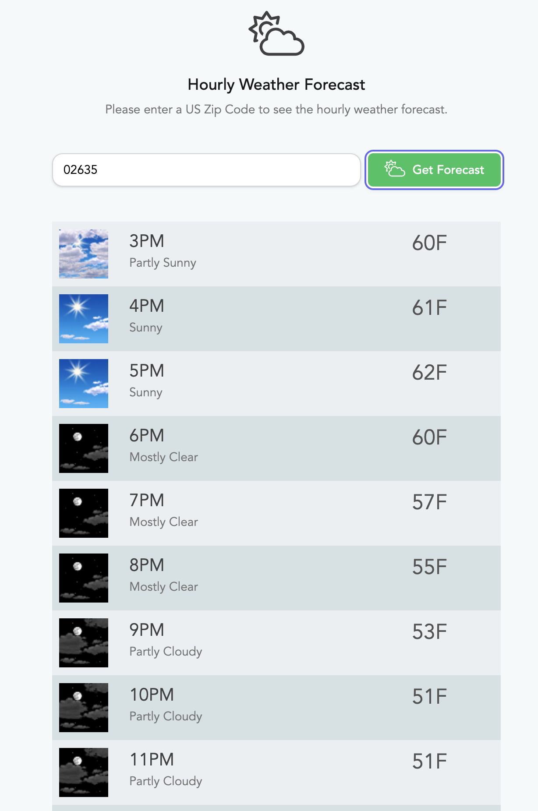

### National Weather Service Front End Proof of Concept

Frontend written with Vue3 and Tailwind to consume the NWS API

**To run this locally:**

1. clone the project from GitHub (not uploaded yet)
2. run `npm install`
3. run `npm run dev`
4. enter a zip code in the available textbox
5. click the "Get Forecast" button
6. scroll

**Areas for Improvement**
1. error handling
2. field validation for the zip code
3. loading element while the API is returning data
4. multi-browser testing

